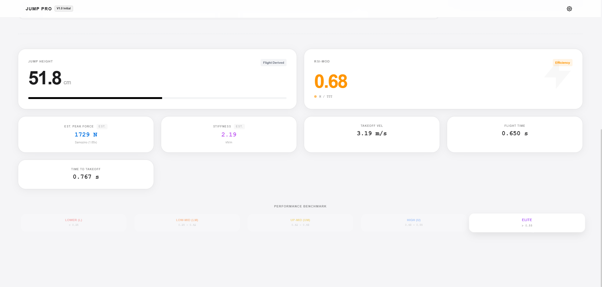

# ⚡️ JumpPro: Biomechanical Video Analysis Lab

  
   
  <h3>Professional Grade Performance Analysis in a Single HTML File.</h3>
  

    <a href="https://Hxu-lab.github.io/JumpPro/">🔴 Live Demo (在线试用)</a>
    ·
    <a href="https://github.com/Hxu-lab/JumpPro/issues">🛠️ Report Bug</a>
    ·
    <a href="https://github.com/Hxu-lab/JumpPro/pulls">🚀 Request Feature</a>
  

---

## 📖 Introduction (简介)

**JumpPro** is a client-side biomechanical analysis tool designed for S&C coaches and sports scientists. It runs entirely in your browser using a **single HTML file**.

Without expensive force plates, you can use high-frame-rate video (slow-motion) to accurately calculate key athletic metrics like **Reactive Strength Index (RSI)**, **Vertical Stiffness**, and **Power**.

It includes an **AI Coach** (powered by DeepSeek) that analyzes the data against elite benchmarks and provides training advice.

> **JumpPro** 是一个运行在浏览器端的轻量级运动生物力学分析工具。无需服务器，单文件即开即用。通过导入高帧率视频，即可精确计算 RSI、垂直刚度等核心指标，并内置 AI 教练提供专业建议。

## ✨ Features (核心功能)

*   **🕵️‍♂️ Privacy First:** Runs 100% locally in your browser. Video never uploads to any server.
*   **📐 Scientific Algorithms:**
    *   **RSI-mod** (Countermovement Jump) based on flight time & takeoff time.
    *   **RSI** (Drop Jump) based on contact time & jump height.
    *   **Vertical Stiffness ($K_{vert}$)** using the **Morin Sine-Wave Approximation Method**.
    *   **Est. Peak Force** using Samozino's method.
*   **🎨 Silky Smooth UI:** Frame-by-frame video scrubbing (Restored V8.5 Core), responsive design with Tailwind CSS & GSAP.
*   **🤖 AI Coach Integration:** Connects to DeepSeek API to generate professional training insights (NSCA-CSCS standard).
*   **📂 Single File:** Just download `index.html` and run.

## 🔬 The Science (科学原理)

JumpPro uses validated biomechanical formulas to estimate metrics from time-domain data:

### 1. Vertical Stiffness (Sine-Wave Method)
Based on the spring-mass model approximation (Morin et al.):

$$ K_{vert} = m \cdot \frac{\pi (t_f + t_c)}{t_c^2 \left( \frac{t_f + t_c}{\pi} - \frac{t_c}{4} \right)} $$

Where $t_f$ is flight time, $t_c$ is contact time, and $m$ is body mass.

### 2. Reactive Strength Index (RSI)
$$ \text{RSI} = \frac{\text{Jump Height (m)}}{\text{Contact Time (s)}} $$

## 🚀 Getting Started (如何使用)

### Option A: Use Online (推荐)
Visit the [Live Demo](https://Hxu-lab.github.io/JumpPro/).

### Option B: Run Locally
1. Download the `index.html` file from this repository.
2. Open it in Chrome, Safari, or Edge.
3. **That's it!**

### 📹 How to Analyze
1. **Upload:** Click "Import Video" (Use 60fps or 120fps/240fps slow-mo for best results).
2. **Set Parameters:** Enter athlete weight and video FPS in settings.
3. **Mark Frames:**
   - **T1 (Start/Contact):** Start of movement (CMJ) or Initial Contact (DJ). *(Optional for CMJ)*
   - **T2 (Takeoff):** The moment toes leave the ground.
   - **T3 (Landing):** The moment toes touch the ground again.
4. **Analyze:** Click the button to see metrics and AI feedback.

## 🛠 Tech Stack

- **HTML5 Canvas** for video rendering.
- **Tailwind CSS** (via CDN) for styling.
- **GSAP** for smooth animations.
- **DeepSeek API** for LLM integration.

## 🤝 Contributing

Pull requests are welcome! For major changes, please open an issue first to discuss what you would like to change.

## 📄 License

[MIT](LICENSE) © 2025 HarleyXu

